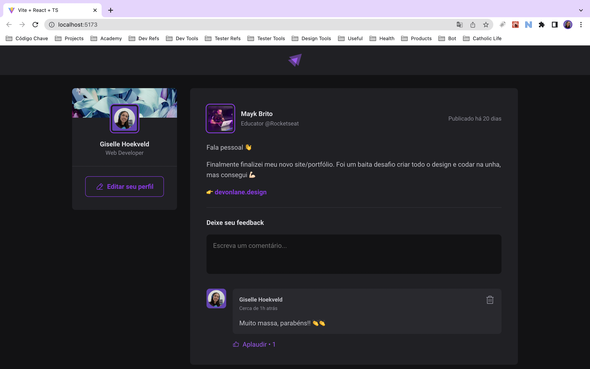
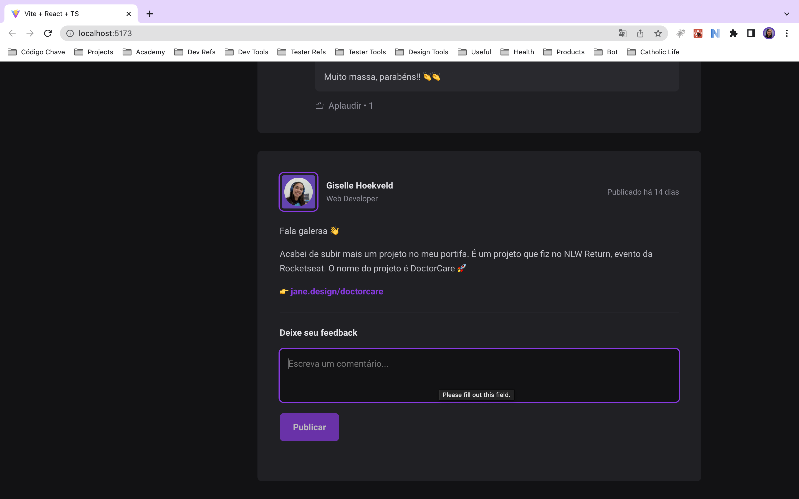

# Feed web

This is a simple web application that allows you to create a feed of your favorite websites.

## Technologies used ☕️ 🐍 ⚛️

- ReactJS
- Typescript

## Features 📋

- View the feed
- Add a new comment
- Delete a comment
- Applaud a comment

## Screenshots 📷

### View the feed


### Add a new comment


## Installation 💻

Clone the repository and install the dependencies.

```bash
git clone
cd feed-web
npm install
```

## Usage 🚀

```bash
npm run dev
```

## Project status 📈

The project is still in development. The next steps are:

- [ ] Add a new feed
- [ ] Edit feed
- [ ] Delete a feed
- [ ] Sign up
- [ ] Sign in
- [ ] Delete a user
- [ ] Edit profile
